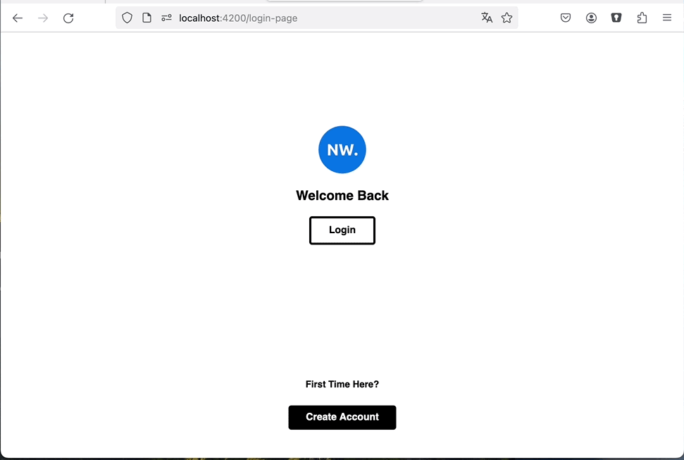

# Angular OAuth & AuthGuard example repo

This repo contains an example of how to use OAuth and AuthGuard in an Angular application. The example uses the [OAuth 2.0 Authorization Code Grant](https://oauth.net/2/grant-types/authorization-code/) flow and Keycloak as an OIDC provider. The provider can be changed to any other OIDC provider by adopting the env variables.

## Documentation

[Sequence Diagrams on PageInitV1.1](pages/sequence_diagrams_page_init_v1.1.md)

[Sequence Diagrams LoginV1.1](pages/sequence_diagrams_login_v1.1.md)

[State Diagram SessionAndTokenHandlingV1.1](pages/state_diagram_session_and_token_handling_v1.1.md)

This project was generated with [Angular CLI](https://github.com/angular/angular-cli) version 17.0.7.

## Development server

Run `ng serve` for a dev server. Navigate to `http://localhost:4200/`. The application will automatically reload if you change any of the source files.

## Code scaffolding

Run `ng generate component component-name` to generate a new component. You can also use `ng generate directive|pipe|service|class|guard|interface|enum|module`.

## Build

Run `ng build` to build the project. The build artifacts will be stored in the `dist/` directory.

## Running unit tests

Run `ng test` to execute the unit tests via [Karma](https://karma-runner.github.io).

## Running end-to-end tests

Run `ng e2e` to execute the end-to-end tests via a platform of your choice. To use this command, you need to first add a package that implements end-to-end testing capabilities.

## Further help

To get more help on the Angular CLI use `ng help` or go check out the [Angular CLI Overview and Command Reference](https://angular.io/cli) page.

## tasks.json
For more information, visit: https://go.microsoft.com/fwlink/?LinkId=733558
